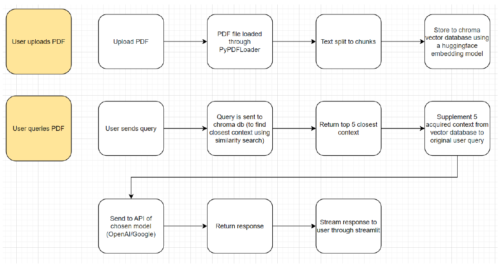

# 🤖 DocuDialogue

Transform your documents into interactive conversations.

## Overview

DocuDialogue is a Streamlit application that allows you to upload PDFs and interact with them using conversational AI models like OpenAI's GPT-4o and Google's Gemini 2.0 Flash.


## Demo


https://github.com/user-attachments/assets/175fde9d-e14c-4b2a-9164-59b87572b67e


## Workflow 



- The priority was to allow users to ask questions about their documents in a
“plug-and-play” fashion
- Users are also allowed to choose between various models (gpt-4o, gpt-4o-mini, and
gemini 2.0 flash) given that they have API keys for these models
- Users are allowed to configure the model’s parameters (temperature, max tokens, top p)
- Chroma DB was used as a vector store
- Preprocessing steps of the PDF includes loading the PDF itself, splitting the text into
chunks, and using an embedding model to store the embeddings to chroma vector
database
- It’s basically a two-step process, on the user-end, since they need to upload the
document, and query it
- Initially, OpenAI’s embedding models were used, but upon checking, it costs in the long
run, so HuggingFace models were used as they are free
- Anthropic’s Claude and Meta’s Llama were initially included in the model list, but due to
limited time, it was scrapped
- Streamlit still as a lot of limitations, as evidenced by a number of issues and feature
requests found online
    - In the future, exploration of gradio can be done to compare which is better

## Prerequisites

- **Python 3.11.11**
- **conda** (Anaconda package manager)

## Installation

1. **Clone the repository**

    ```bash
    git clone <repository-url>
    cd thinking-machines-mle-genai-exam
    ```

2. **Create a conda environment (recommended)**

    ```bash
    conda create --name myenv python=3.11.11
    ```

    **Activate the conda environment:**

    ```bash
    conda activate myenv
    ```

3. **Install the required packages**

    ```bash
    pip install -r requirements.txt
    ```

## Usage

1. **Run the application**

    ```bash
    streamlit run app/main.py
    ```

2. **Access the application**

    Open your web browser and navigate to [http://localhost:8501](http://localhost:8501).

3. **Upload your documents**

    Use the sidebar to upload your PDF files.

4. **Configure the model**

    In the sidebar:
    - **Model Selection**: Choose the AI model you want to use.
    - **API Key**: Enter your API key when prompted.

5. **Interact with your documents**

    Start asking questions in the chat interface about your uploaded documents.

## Notes

- **No .env file is needed**: API keys are entered directly in the application's sidebar.
- **LLM Parameters**: Adjust parameters like Temperature, Max Output Tokens, and Top P in the sidebar under "LLM Parameters".

## License

This project is licensed under the MIT License. See the LICENSE file for details.
